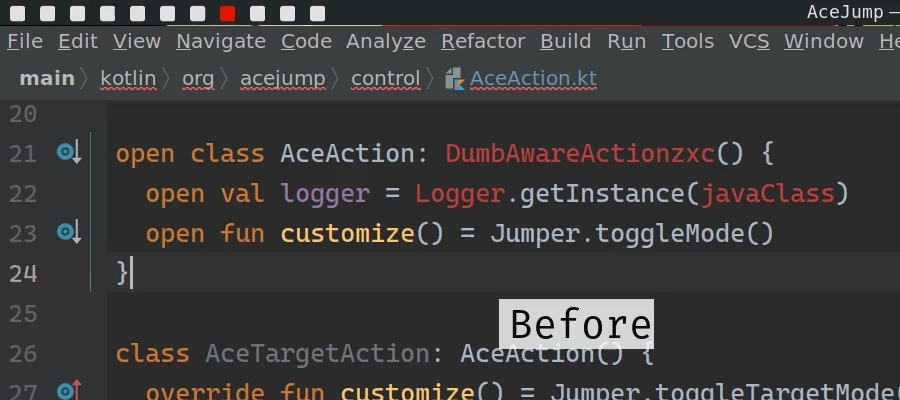
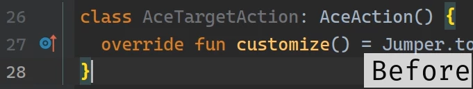
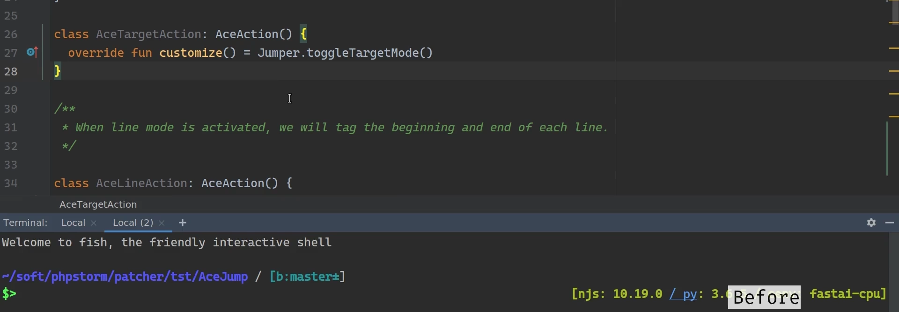
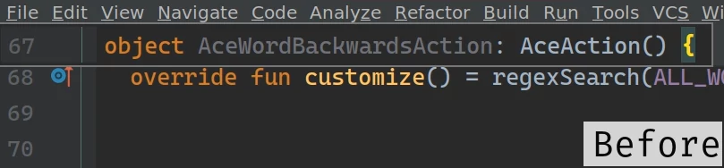
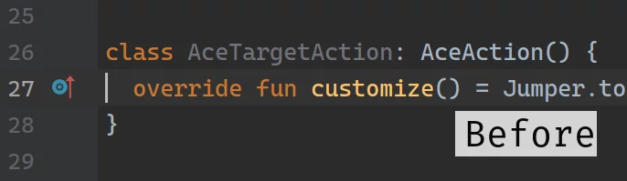
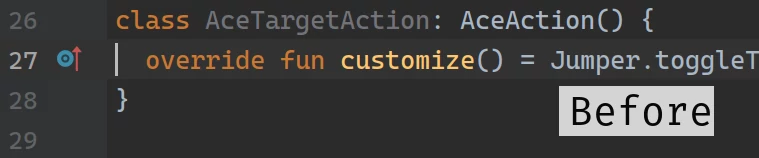

## 0 - Removing 1 line scroll ahead

## 1 - Removing highlight on whole row, leaving only on left sidebar

## 2 - Removing auto hide on tool windows (dock unpinned)

## 3 - Removing tooltip which appears on top when cursor is on bracket

## 4 - Reduce spacing between gutter and editor (shrink)

## 6 - Changes line numbers and icons order

## 9 - Reducing gap between areas (better with #4)

Only affect some themes and configurations, so better try it by yourself

## 12 - Disabling remove from stack for tool windows(SLIDING/UNDOCKED only)

Only affect tool windows which are in UNDOCKER/SLIDING state, in 2020 idea broken the way they working. With patch you will be able to hide window and then jump back to it, without jump back is have no effect.

## 13 - Changind autocomplete popup to SMART one from BASIC

Only affect autocomplete popup behavour, changing it to SMART type always.

## All - All together example

